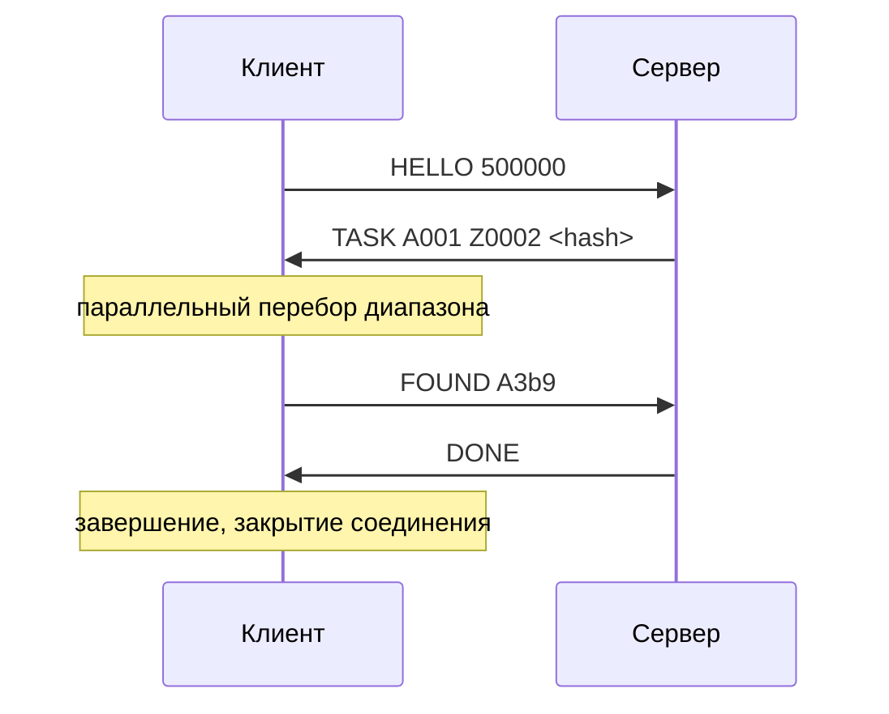

# Документация: клиентская нода подбора паролей

## 1. Описание задачи

Программа реализует клиентскую вычислительную ноду для распределённой системы подбора ключей. По заданной хэш-сумме вида `sha1(md5(key))` клиент выполняет перебор ключей в заданном лексикографическом диапазоне.

**Допустимые символы ключа:** `[0-9A-Za-z]`  
**Длина ключа:** от 1 до 32 символов  
**Лексикографический порядок:** сначала по длине, затем лексикографически внутри одной длины.

Порядок символов в алфавите: `0123456789ABCDEFGHIJKLMNOPQRSTUVWXYZabcdefghijklmnopqrstuvwxyz`

---

## 2. Запуск программы

### Клиент

```
./app <host> <port> <path_to_hashrate_file>
```

| Аргумент                | Описание                                                              |
|-------------------------|-----------------------------------------------------------------------|
| `host`                  | Адрес управляющего сервера (hostname или IP)                          |
| `port`                  | TCP-порт сервера (1-65535)                                            |
| `path_to_hashrate_file` | Путь к файлу с числом — оценкой производительности (хэшей в секунду) |

### Сервер

```
./server <port> <start> <end> <hash> <num_clients>
```

| Аргумент      | Описание                                              |
|---------------|-------------------------------------------------------|
| `port`        | TCP-порт для прослушивания (1-65535)                  |
| `start`       | Начало диапазона поиска (включительно)                |
| `end`         | Конец диапазона поиска (включительно)                 |
| `hash`        | Целевой хэш `sha1(md5(key))` в hex-формате (40 симв) |
| `num_clients` | Ожидаемое количество клиентов                         |

Сервер завершается с кодом `0` если ключ найден (выводит `RESULT <key>`), с кодом `1` если не найден (выводит `RESULT NOT_FOUND`), с кодом `2` при фатальной ошибке.

---

## 3. Сетевой протокол

Протокол текстовый, поверх TCP. Каждое сообщение — одна строка, завершённая символом `\n`. Поля разделяются пробелами.

### 3.1 Сообщения клиент -> сервер

#### `HELLO <hashrate>`

Отправляется при подключении и после каждого ожидания (`WAIT`). Сообщает серверу производительность клиента.

| Поле       | Тип    | Описание                              |
|------------|--------|---------------------------------------|
| `hashrate` | uint64 | Количество вычислений sha1(md5) в сек |

---

#### `FOUND <key>`

Отправляется, если ключ найден в диапазоне.

| Поле  | Тип    | Описание       |
|-------|--------|----------------|
| `key` | string | Найденный ключ |

---

#### `NOT_FOUND`

Отправляется, если ключ не найден в диапазоне.


---

### 3.2 Сообщения сервер -> клиент

#### `TASK <start> <end> <hash>`

Задача на перебор диапазона.

| Поле    | Тип    | Описание                                  |
|---------|--------|-------------------------------------------|
| `start` | string | Начало диапазона (включительно)           |
| `end`   | string | Конец диапазона (включительно)            |
| `hash`  | string | Целевой хэш в формате sha1(md5(key)), hex |

---

#### `WAIT <seconds>`

Команда ожидания. Клиент ждёт указанное количество секунд, затем повторно отправляет `HELLO`.

| Поле      | Тип    | Описание             |
|-----------|--------|----------------------|
| `seconds` | uint32 | Время ожидания в сек |

---

#### `DONE`

Команда завершения работы. Клиент корректно завершает соединение и выходит.

---

### 3.3 Диаграмма взаимодействия



---

## 4. Обработка ошибок

| Ситуация                                   | Поведение                                         |
|--------------------------------------------|---------------------------------------------------|
| Неверное число аргументов                  | Вывод usage и выход с кодом 1                     |
| Неверный порт                              | Сообщение об ошибке и выход с кодом 1             |
| Файл производительности не найден          | Сообщение об ошибке и выход с кодом 1             |
| Нулевое или некорректное значение hashrate | Сообщение об ошибке и выход с кодом 1             |
| Ошибка подключения к серверу               | Исключение с описанием, выход с кодом 1           |
| Разрыв соединения во время работы          | Сообщение в stderr, корректное завершение         |
| Неизвестное сообщение от сервера           | Сообщение в stderr, продолжение ожидания          |
| Некорректный диапазон в задаче             | Немедленный ответ `NOT_FOUND`                     |

---

## 5. Тестирование

Тесты запускаются через Python-скрипт, который поднимает C++ сервер и проверяет поведение клиента:

```bash
python3 tests/run_tests.py
```

Перед запуском тестов необходимо собрать оба бинарника (`app` и `server`) в директории `build/`.

| Сценарий                    | Описание                                                         |
|-----------------------------|------------------------------------------------------------------|
| `single_client_found`       | 1 клиент находит ключ `b` в диапазоне `a`-`z`                   |
| `single_client_not_found`   | 1 клиент, ключ отсутствует в диапазоне                           |
| `single_client_numeric`     | 1 клиент находит ключ `500` в диапазоне `100`-`999`              |
| `two_clients_key_in_first`  | 2 клиента, ключ `b5` в первом сегменте                           |
| `two_clients_key_in_second` | 2 клиента, ключ `z0` во втором сегменте                          |
| `two_clients_not_found`     | 2 клиента, ключ отсутствует                                      |
| `three_clients_found`       | 3 клиента находят ключ `mm`                                      |
| `three_clients_not_found`   | 3 клиента, ключ отсутствует                                      |
| `single_char_range_found`   | 1 клиент находит ключ `9` в диапазоне `0`-`z`                   |
| `single_char_range_found_2` | 2 клиента находят ключ `A` в диапазоне `0`-`z`                  |

---

## 6. Сборка

```bash
cd hw4
cmake -B build -DCMAKE_BUILD_TYPE=Release
cmake --build build
```
